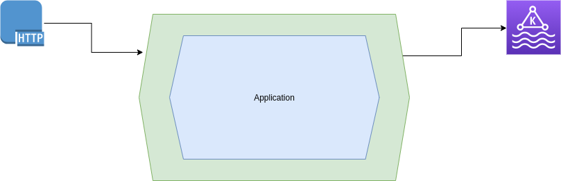

# Spring Cloud Stream Function
Spring-cloud-stream with Kafka and using JSON as a serializer and deserializer.

### Frameworks
- Spring / Netty / Kafka

### Programming Language
- Java

### Hexagonal Architecture
In this application hexagonal architecture was used:




### Prerequisites
- [docker](https://docker)
- [docker-compose](https://docker-compose)
- [postman](https://postman) or [curl](https://curl)
- [java >= 11](https://java)

### Running Application
- Go to the project directory
```
$ cd <project directory>
```
- Boot the Kafka infrastructure
```
$ docker-compose up
```
- Create a new topic
```
$ docker-compose exec broker kafka-topics --create --topic user-topic --partitions 1 --replication-factor 1 --if-not-exists --zookeeper zookeeper:2181
```
- Put a listener consumer
```
docker-compose exec broker kafka-console-consumer --topic user-topic --from-beginning --bootstrap-server localhost:9092
```
- Run the application
```
$ ./gradlew run
```
- Create a user (POST request)
```
$ curl --location --request POST 'http://localhost:8080/user' \
  --header 'Content-Type: application/json' \
  --data-raw '{
      "id": 001,
      "name": "André dos Santos"
  }'
```
- Look at the application log to view the message being produced according to this example.
